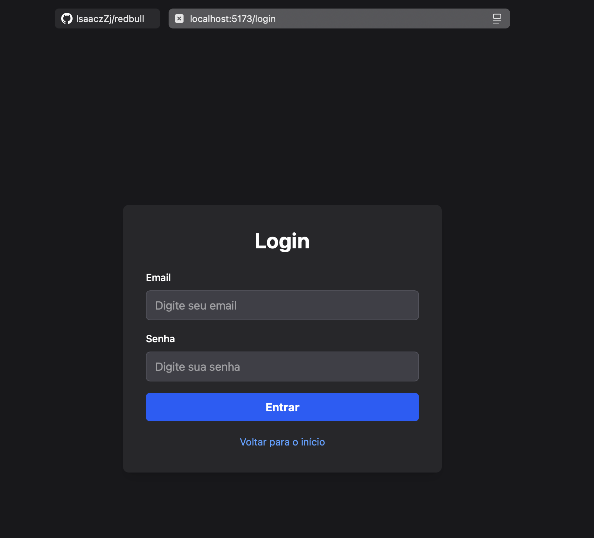
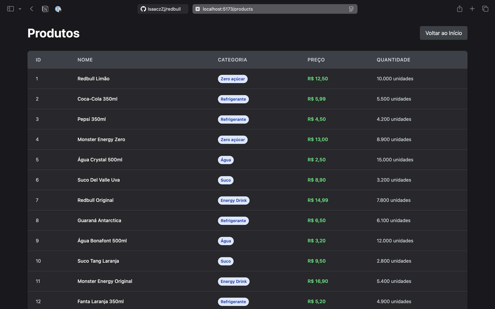

# Desafio Redbull
## Descrição do projeto
Um sistema para gerenciamento de estoque de Redbull.
### Tecnologias utilizadas
Frontend com Javascript usando Vite
Backend usando Node.js com Express

## Como rodar o projeto
### Instalar dependências
*Necessário ter node instalado no ambiente.*
Instale as dependencias do projeto rodando o comando abaixo.
Rode `pnpm install`.

### Subir o servidor
Suba o servidor rodando o comando abaixo.
Rode `pnpm dev`.

## Funcionalidades utilizadas
### Tela de Boas vindas

### Tela de login

### Pagina de Produtos
